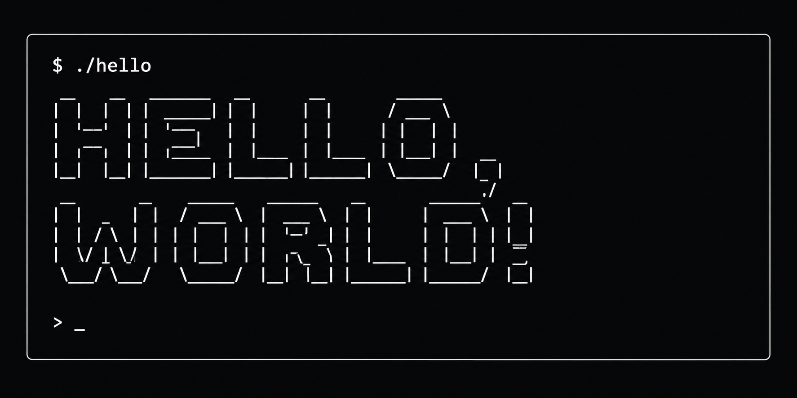

  

<h1 align="center">Hello dude!</h1>

  Full Stack Engineer focused on Backend, Cloud & Software Architecture.

  Java · TypeScript · JavaScript

  Spring Boot · Node.js · Express.js · React

  PostgreSQL · MongoDB · MySQL

  Docker · Kubernetes · AWS · Git · Maven · Gradle

---

## About Me

- Building scalable backend systems and cloud-native applications.
- Passionate about clean architecture, automation, and maintainable software.
- Experienced in designing secure APIs and distributed systems.
- Focused on performance, reliability, and developer experience.
- Always learning and exploring new technologies.

---

  

